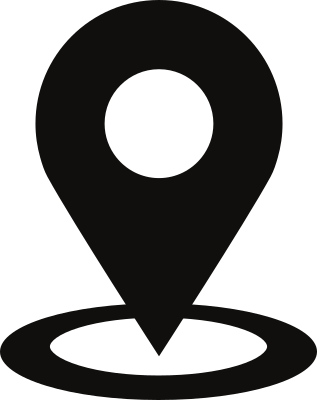
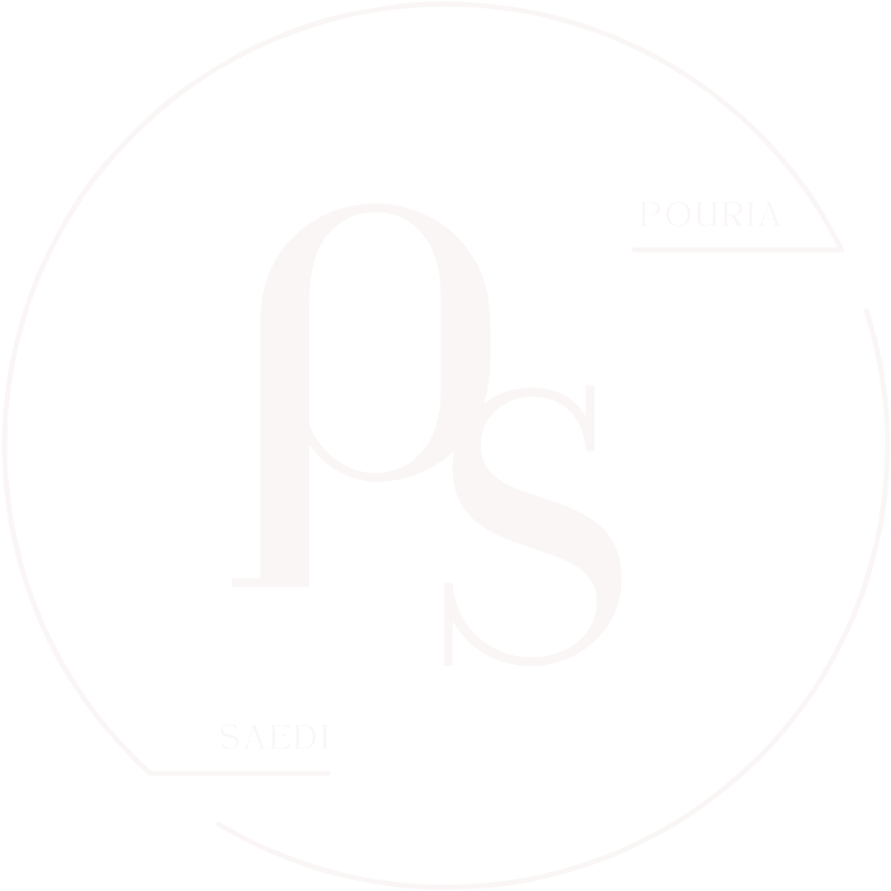

# Footer Implementation Documentation

## Overview
The footer component is designed to provide consistent contact information, location, and branding across all pages of the portfolio. It features a responsive layout with theme-aware styling that automatically adapts to both light and dark modes.

## HTML Structure

```html
<footer class="footer">
    <div class="footer-content">
        <p>
            
            Milan, Italy
        </p>
        <p><a href="mailto:pouria.saedi@mail.polimi.it">pouria.saedi@mail.polimi.it</a></p>
        <p>2026, Pouria Saedi</p>
    </div>
    
</footer>
```

### Components

1. **Footer Container** (`.footer`)
   - Main wrapper for the entire footer section
   - Uses flexbox for horizontal layout on desktop, vertical on mobile

2. **Footer Content** (`.footer-content`)
   - Contains text information (location, email, copyright)
   - Flexible container that takes up available space

3. **Location Information**
   - SVG icon (`location_pin_007.svg`) with accompanying text
   - Icon adapts to theme using CSS filters

4. **Logo** (`.footer-logo`)
   - Brand logo (`PS_LOGO.svg`) positioned on the right
   - Theme-aware with automatic color inversion

## CSS Styling

### Base Styles

```css
.footer {
    margin-top: 3rem;              /* Spacing from content above */
    padding-top: 2rem;             /* Internal top padding */
    border-top: 1px solid #e0e0e0; /* Separator line (light theme) */
    font-size: 0.9rem;             /* Slightly smaller text */
    color: #666;                   /* Gray text (light theme) */
    transition: all 0.5s cubic-bezier(0.4, 0, 0.2, 1); /* Smooth theme transitions */
    display: flex;                 /* Flexbox layout */
    justify-content: space-between; /* Space between content and logo */
    align-items: flex-start;       /* Align items to top */
    flex-wrap: wrap;               /* Allow wrapping on small screens */
    gap: 2rem;                     /* Space between flex items */
}
```

### Dark Mode Adaptation

```css
body.dark-mode .footer {
    border-top-color: #444; /* Darker border for dark theme */
    color: #999;            /* Lighter text for dark theme */
}
```

### Footer Content

```css
.footer-content {
    flex: 1; /* Takes up available space, pushing logo to the right */
}

.footer p {
    margin: 0.5rem 0;        /* Vertical spacing between paragraphs */
    display: flex;           /* Flexbox for icon alignment */
    align-items: center;     /* Vertically center icon with text */
    gap: 0.5rem;            /* Space between icon and text */
}
```

### Location Icon

```css
.footer .location-icon {
    width: 1.2rem;
    height: 1.2rem;
    transition: filter 0.5s cubic-bezier(0.4, 0, 0.2, 1);
}

body.dark-mode .footer .location-icon {
    filter: brightness(0) invert(1); /* Inverts black icon to white in dark mode */
}
```

**Filter Explanation:**
- `brightness(0)`: Converts the icon to pure black
- `invert(1)`: Inverts black to white for dark mode

### Links

```css
.footer a {
    color: inherit;         /* Use parent color */
    text-decoration: none;  /* Remove underline by default */
}

.footer a:hover {
    text-decoration: underline; /* Show underline on hover */
}
```

### Logo Styling

```css
.footer-logo {
    width: 3.5rem;
    height: 3.5rem;
    transition: filter 0.5s cubic-bezier(0.4, 0, 0.2, 1);
    filter: brightness(0); /* Makes logo black in light mode */
}

body.dark-mode .footer-logo {
    filter: brightness(0) invert(1); /* Makes logo white in dark mode */
}
```

**Logo Color Logic:**
- **Light Mode**: `brightness(0)` → Black logo
- **Dark Mode**: `brightness(0) invert(1)` → White logo

### Responsive Design

```css
@media screen and (max-width: 768px) {
    .footer {
        flex-direction: column; /* Stack vertically on mobile */
        align-items: center;    /* Center align all items */
        text-align: center;     /* Center text */
    }
    
    .footer-logo {
        margin-top: 1rem; /* Add space above logo */
    }
}
```

## Design Principles

### 1. **Responsiveness**
- Desktop: Horizontal layout with content on left, logo on right
- Mobile: Vertical stack with centered alignment

### 2. **Theme Awareness**
- Automatic adaptation to light/dark modes
- Smooth transitions using cubic-bezier easing
- Consistent 0.5s transition duration across all theme changes

### 3. **Accessibility**
- Semantic HTML5 `<footer>` element
- Descriptive alt text for images
- Proper link styling with hover states
- Sufficient color contrast in both themes

### 4. **Visual Hierarchy**
- Clear separation from main content (border-top)
- Balanced layout with proper spacing
- Subtle text color differentiation from body content

### 5. **Performance**
- CSS transitions instead of JavaScript animations
- SVG images for scalability and small file size
- Minimal DOM elements

## Theme Transition Details

The footer uses a sophisticated transition system:

```css
transition: all 0.5s cubic-bezier(0.4, 0, 0.2, 1);
```

**Cubic-bezier curve breakdown:**
- `(0.4, 0, 0.2, 1)` creates a "ease-in-out" effect with slight acceleration
- This matches Material Design's "standard easing"
- Applied to borders, colors, and filters for cohesive theme switching

## Assets Required

1. **location_pin_007.svg** - Location pin icon
2. **PS_LOGO.svg** - Personal brand logo

Both assets should be:
- In SVG format for scalability
- Originally dark/black colored
- Located in the same directory as HTML files

## Integration Notes

To implement this footer on a new page:

1. Copy the entire CSS footer section (lines 272-345 in project-smarthome.html)
2. Copy the HTML footer structure (lines 466-477 in project-smarthome.html)
3. Ensure SVG assets are in the correct path
4. Ensure dark mode toggle functionality is implemented on the page
5. Test theme switching to verify proper color transitions

## Browser Compatibility

- Modern browsers: Full support
- Flexbox: All modern browsers
- CSS filters: All modern browsers
- SVG: Universal support
- Transitions: All modern browsers

## Future Enhancement Ideas

- Add social media links with icons
- Include a "back to top" button
- Add animation on scroll into view
- Include additional contact methods (phone, LinkedIn, etc.)
